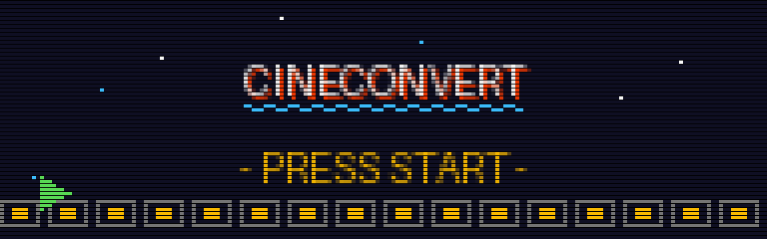
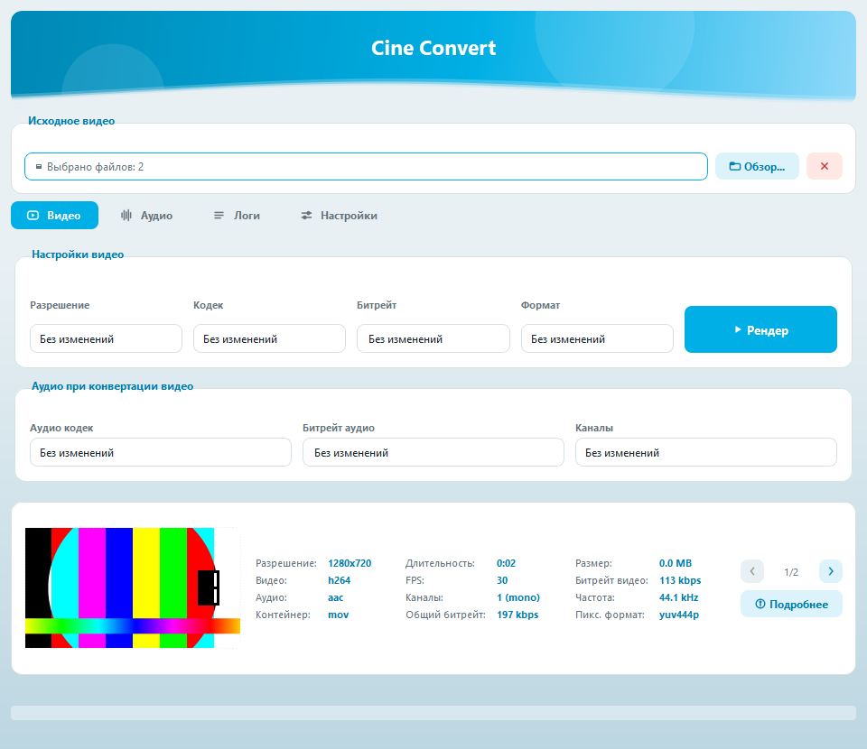
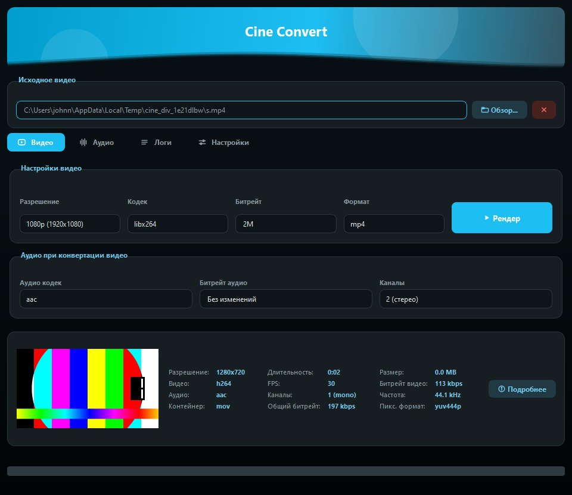
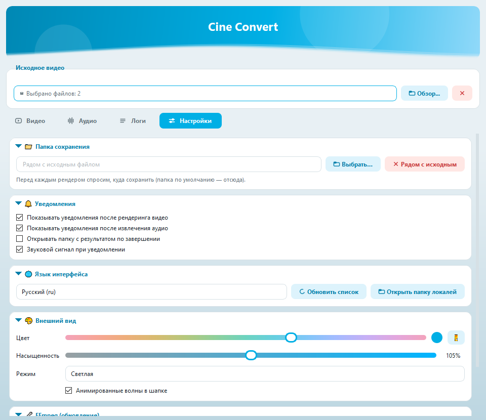

<div align="center">



# 🎮 CINECONVERT

**Портативный видеоконвертер для Windows на движке FFmpeg**

*Вставь картридж • Нажми START • Конвертируй*


</div>

---

```
════════════════════════════ СЮЖЕТ ════════════════════════════
```

**CineConvert** — конвертер видео, который работает **из коробки**: скачал, запустил, конвертируешь. Без установки, без реестра, без «скачайте ещё вот это». Все настройки хранятся в `config.json` рядом с программой — можно носить на флешке.

Под капотом — **FFmpeg**, снаружи — аккуратный интерфейс с живой темой: выбираешь любой цвет радужным слайдером, и всё приложение перекрашивается на лету. Есть светлый и тёмный режимы.

<div align="center">



</div>

```
═══════════════════════════ POWER-UPS ═══════════════════════════
```

| | Возможность | Описание |
|---|---|---|
| 🎬 | **Конвертация видео** | Разрешение (4K→144p), кодек (x264, x265, NVENC, VP9, AV1), битрейт, контейнер (mp4, mkv, mov, avi, flv, webm) |
| ⚡ | **Умный режим без потерь** | Если параметры не меняются — потоки **копируются 1:1** без перекодирования: mp4→mkv за секунду и без потери качества |
| 🎧 | **Аудио при конвертации** | Кодек (aac, mp3, flac, opus, ac3), битрейт, каналы (моно/стерео/5.1/7.1) или «копировать как есть» |
| 🎵 | **Извлечение аудио** | Вытащить звуковую дорожку в mp3, aac, flac, wav, ogg, ac3 |
| 📦 | **Пакетная обработка** | Выбери несколько файлов (или перетащи) — сконвертируются по очереди |
| 🔍 | **Информация о видео** | Превью-кадр + 12 характеристик сразу; кнопка «Подробнее» открывает полный разбор всех потоков; при мультивыборе файлы листаются кнопками ‹ › |
| 🖥 | **Живая тема** | Любой цвет (OKLCH-слайдер + пипетка), насыщенность, светлая/тёмная/системная, анимированные волны в шапке |
| 🌐 | **7 языков** | ru, en, de, es, fr, zh, ar — переводы в простых JSON, легко добавить свой |
| 🔄 | **Обновление FFmpeg в 1 клик** | Настройки → FFmpeg: сверяет версию с последней сборкой gyan.dev и обновляет атомарно (с откатом при сбое) |
| 💾 | **Всё сохраняется само** | Кнопки «Сохранить» нет — каждая настройка применяется и запоминается мгновенно, включая размер окна |

```
═══════════════════════════ УПРАВЛЕНИЕ ═══════════════════════════
```

1. **📂 Выбери видео** — кнопка «Обзор…» (можно несколько) или перетащи файлы в окно
2. **⚙ Настрой** — вкладка «Видео»: разрешение / кодек / битрейт / формат + аудио-параметры ниже. Оставь «Без изменений» — получишь мгновенный remux без потерь
3. **▶ Жми «Рендер»** — программа спросит, куда сохранить (папка по умолчанию настраивается), покажет прогресс, скорость и оставшееся время
4. **🏁 Готово** — уведомление со звуком, кнопки «Открыть файл» / «Открыть папку»

Извлечение звука — вкладка **«Аудио»**: формат → «Извлечь аудио».

```
══════════════════════════ SELECT LEVEL ══════════════════════════
                     (какой файл скачивать)
```

Скачай из [**Releases**](https://github.com/bboyJohnn/CineConvert/releases) один из двух вариантов:

| Файл | Размер | Для кого |
|---|---|---|
| 🕹 **CineConvert-portable.zip** | ~110 МБ | **Рекомендуется.** Распаковал → запустил `CineConvert.exe` → работает сразу, полностью офлайн. FFmpeg уже внутри |
| 🪶 **CineConvert.exe** | ~37 МБ | Лёгкий вариант. При первом запуске сам скачает FFmpeg (~80 МБ, нужен интернет один раз) |

> Ничего устанавливать не нужно: ни Python, ни библиотеки, ни FFmpeg отдельно. Windows SmartScreen может спросить про неизвестного издателя — «Подробнее» → «Выполнить в любом случае».

```
═══════════════════════════ СКРИНШОТЫ ═══════════════════════════
```

<div align="center">

| Тёмная тема | Настройки |
|---|---|
|  |  |

</div>

```
═══════════════════ ХАРАКТЕРИСТИКИ КАРТРИДЖА ═══════════════════
```

- **Один файл исходника** — весь интерфейс и логика в `CineConvert.py` (~2700 строк, PyQt5/PyQt6-совместимо)
- **Тема** — цвета считаются в OKLCH (как в современном CSS) и собираются в Qt-стили на лету
- **Воркеры** — FFmpeg крутится в отдельных потоках, интерфейс не подвисает, конвертацию можно отменить
- **Надёжное обновление FFmpeg** — скачивание с докачкой в `.part`, проверка запуска нового бинарника, атомарная подмена папки с бэкапом и откатом
- **Конфиг** — `config.json` рядом с exe: тема, язык, папка сохранения, последние настройки кодирования, размер окна
- **Локали** — `locales/*.json`: ключ = objectName виджета или текст пункта; файл с полем `"name"` появляется в списке языков автоматически

```
════════════════════════ СБОРКА ИЗ ИСХОДНИКОВ ════════════════════════
                    ↑ ↑ ↓ ↓ ← → ← → B A START
```

```bash
# Игрок 1 присоединился
git clone https://github.com/bboyJohnn/CineConvert.git
cd CineConvert
pip install PyQt5 pyinstaller pillow

# Запуск из исходника (FFmpeg скачается сам при первом старте)
python CineConvert.py

# Сборка exe + портативного zip (папка release/)
python build_release.py
```

```
═══════════════════════════ КОНТИНЬЮ ═══════════════════════════
```

- 📁 **`old/`** — предыдущая версия программы (один экран, старый дизайн). Хранится для истории
- 🐛 **Баг?** — открой [Issue](https://github.com/bboyJohnn/CineConvert/issues) с логом из вкладки «Логи»
- 🧡 Построено на [FFmpeg](https://ffmpeg.org/) (сборки [gyan.dev](https://www.gyan.dev/ffmpeg/builds/)) и [PyQt5](https://pypi.org/project/PyQt5/)

<div align="center">

```
  GAME OVER? НЕТ — ЖМИ «РЕНДЕР» ЕЩЁ РАЗ
  © bboyJohnn • CONTINUE ▶
```

</div>
